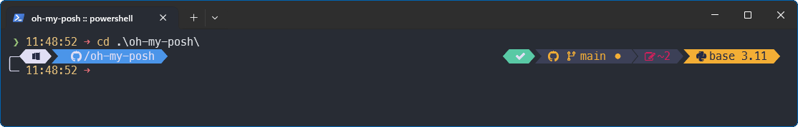

# Lucaslrodri Theme for [Oh My Posh](https://ohmyposh.dev/)

> A personal theme for [Oh My Posh](https://ohmyposh.dev/).

> Windows (PowerShell)

> WSL - Linux (ZSH)

The theme provides integration ([segments](https://ohmyposh.dev/docs/configuration/segment)) with `git`, `python`, `node`, and `dotnet`.

## Installation

### Install Oh My Posh

1. Download the `lucaslrodri.omp.json` file [here](https://github.com/lucaslrodri/oh-my-posh/releases/latest).

2. To install [Oh My Posh](https://ohmyposh.dev/) on macOS, Windows, or Linux, follow the documentation [here](https://ohmyposh.dev/docs/installation).

### Activate the Theme

For instructions on activating the theme, please refer to the documentation [here](https://ohmyposh.dev/docs/installation/customize).

> [!NOTE]
>
> Tested on `PowerShell` and `zsh`. This theme may be compatible with other shells that support [Oh My Posh](https://ohmyposh.dev/). For more information, follow the documentation [here](https://ohmyposh.dev/docs/installation/prompt).

### Fonts

1. This theme was tested with the Nerd Font [Meslo LGM NF](https://github.com/ryanoasis/nerd-fonts/releases/download/v3.0.2/Meslo.zip). Other Nerd Fonts may also work but should be tested before use.
2. [Oh My Posh](https://ohmyposh.dev/) provides a utility to install [Nerd Fonts](https://www.nerdfonts.com/). Please refer to the documentation [here](https://ohmyposh.dev/docs/installation/fonts).

## Thanks

💙 Inspired by [patriksvensson](https://github.com/JanDeDobbeleer/oh-my-posh/blob/main/themes/patriksvensson.omp.json), [quick-term](https://github.com/JanDeDobbeleer/oh-my-posh/blob/main/themes/quick-term.omp.json), and [Powerlevel10k](https://github.com/romkatv/powerlevel10k).

## License

[MIT License](./LICENSE)