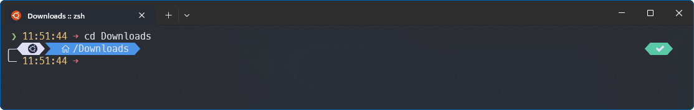

# Lucaslrodri theme for [Oh My Posh](https://ohmyposh.dev/)

> A personal theme for [Oh My Posh](https://ohmyposh.dev/).

> Windows (Powershell)

> WLSS - Linux (ZSH)

The theme provides integration ([segments](https://ohmyposh.dev/docs/configuration/segment)) with `git`, `python`, `node` and `dotnet`.

## Install

#### Install Oh My Posh

To install [Oh My Posh](https://ohmyposh.dev/) on MacOS/Windows/Linux follow documentation [here](https://ohmyposh.dev/docs/installation/windows).

#### Active the theme Theme

For instructions on activating this theme please refer to the documentation [here](https://ohmyposh.dev/docs/installation/customize).

> [!NOTE]
>
> Tested on `powershell` and `zsh`, but may be compatible with any compatible with Oh My Posh. For more information follow documentation [here](https://ohmyposh.dev/docs/installation/prompt).

### Fonts

[Oh My Posh](https://ohmyposh.dev/) has a utility to install a compatible [Nerd Font](https://www.nerdfonts.com/), please refer to the documentation [here](https://ohmyposh.dev/docs/installation/fonts). This theme was tested with [Meslo LGM NF](https://github.com/ryanoasis/nerd-fonts/releases/download/v3.0.2/Meslo.zip), for other fonts you should test it before.

## License

[MIT License](./LICENSE)

💙 Inspired by <a href="https://github.com/JanDeDobbeleer/oh-my-posh/blob/main/themes/patriksvensson.omp.json">patriksvensson</a> + <a href="https://github.com/JanDeDobbeleer/oh-my-posh/blob/main/themes/quick-term.omp.json">quick-term</a> + <a href="https://github.com/romkatv/powerlevel10k">Powerlevel10k</a>.

